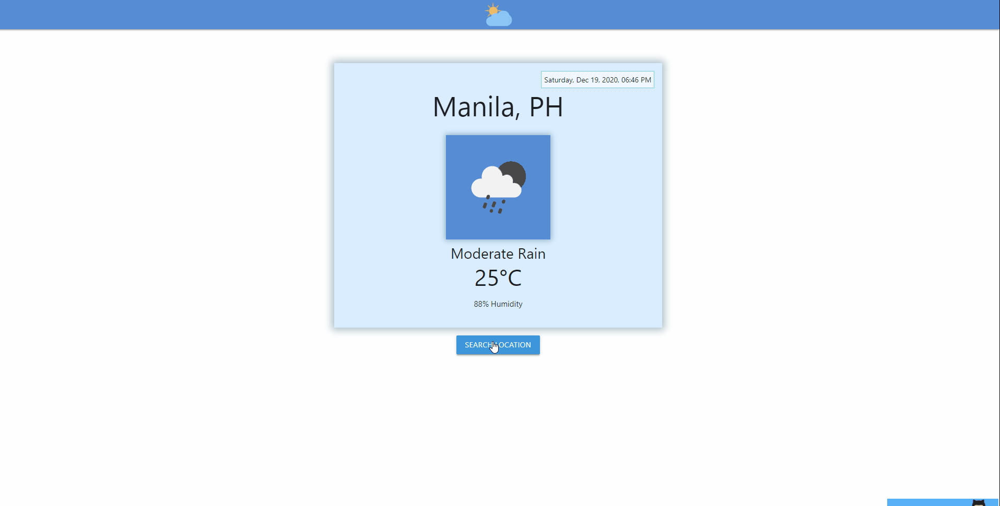

# Simple Weather App

Use to check the weather updates base on the location you want.



## Installation

```bash
npm install
```

## Usage

```base
npm start #run client side localhost
```

### Dependencies

axios, materializecss

### Notes

decided to remove updates of forecast details because of API not allowing it in free subscription plan.

## Credits

API Openweathermap
[a link](https://openweathermap.org/)
